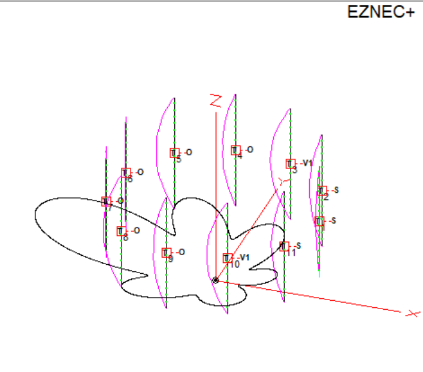

# `radio-notebooks`

This is a repository to back up in-progress and finished Jupyter notebooks for some of my ham radio projects.

## M.T. Ma Array Optimization

`optimal_array_working_II.ipynb` is my local work-in-progress copy of [this colab project](https://colab.research.google.com/drive/1wYXeli_duxK5gw9uycqAuD0LmVXuqpQU?usp=sharing) implementing M.T. Ma's eigenvalue method for finding the optimal currents for an arbitrary 2D phased array.

If you want to play with the notebook, the Google Colab link is probably easiest.

## Parasitic 11-Circle

The `Parasitic_Circle_Array*.ipynb` notebooks are experiments in optimizing a parasitic 11-circle vertical dipole array for 20m using [PyNEC](https://github.com/tmolteno/python-necpp/tree/master/PyNEC). 

This also is a backup/working copy of [a colab project](https://colab.research.google.com/drive/1LNp7QuVXy26LK7XfYa7ak2DsrPy3mqXA?usp=sharing) that you can investigate.

The directory [N3OX_Eleven](./N3OX_Eleven) has an EZNEC model and details of a realization of this array using shorted and open transmission line stubs. The stubs are long enough to reach the array center for element loading, so this could probably be built.

